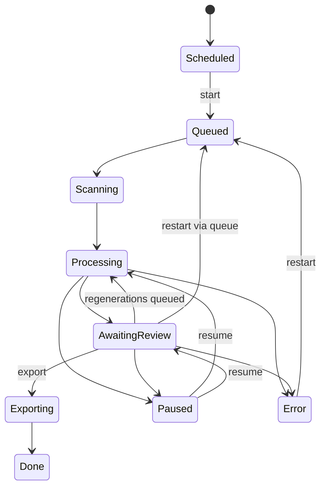

# Batch Lifecycle

How a batch's state changes from creation to export completion.

## For beginners

A batch is a group of images you process together. A batch always has a current state, shown as a coloured badge in the interface.

A typical batch journey:

**Scheduled** — the batch is set to start automatically at a scheduled time but hasn't started yet.

**Queued** — the batch is waiting in line. If another batch is running, this one waits its turn.

**Scanning** — a quick preliminary pass: metadata is read for every image.

**Processing** — the main work: each image goes through the analyst, normaliser, and checkers.

**Awaiting Review** — processing is complete. Images are waiting for your decision. Next steps: start export, send some images for regeneration, or pause the batch.

**Exporting** — accepted captions are written as files next to the images.

**Done** — the batch is fully complete.

**Paused** — processing is suspended. Reachable from any active state. Once the cause is resolved the batch can be resumed and will continue from where it stopped.

**Error** — an unrecoverable error. Manual intervention required. After the fix the batch can be restarted via Queued.

## For professionals

The batch queue is single-lane FIFO. At most one batch is processed at a time. The scheduler starts Scheduled batches at the right time by moving them to Queued.

**Paused** is a soft stop triggered by reaching the consecutive transient LLM error threshold. It is not an error state; the batch resumes with a Resume command without losing progress.

**Crash recovery** — on server restart, batches in Processing or Scanning are automatically moved back to Queued and reprocessed from the beginning (already processed items are preserved in the database).

## Effect on your workflow

While a batch is in Processing or Scanning, its settings cannot be edited. The review button becomes active only when the batch reaches Awaiting Review.

For individual image states, see [Image Lifecycle](pipeline_image_lifecycle.md).
