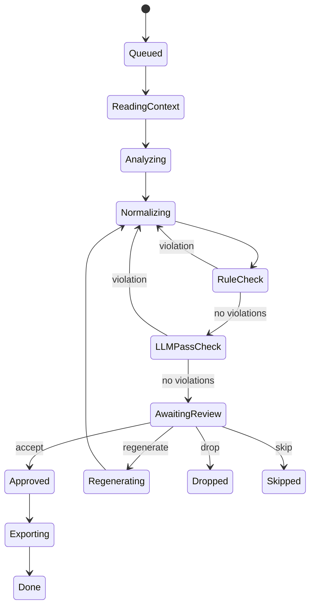

# Image Lifecycle

How a single image's state changes through the entire processing flow.

## For beginners

Each image in a batch travels its own path independently. Its state shows which step it is at or what happened to it.

After review you have four choices:

- **Accept** — the caption is good; send it to export.
- **Regenerate** — ask the pipeline to rewrite the caption.
- **Drop** — the image is not needed in the dataset.
- **Skip** — defer the decision for later.

## For professionals

The Normalizing → RuleCheck → LLMPassCheck loop is governed by a shared attempt counter. Several iterations are allowed by default; when the counter is exhausted the item moves to ERROR with category `policy`.

**Regenerating** — after a "regenerate" review decision the item returns to Normalizing. The analyst does not re-run — the existing image description is reused. This lets you fix a normalisation problem without extra LLM calls for image analysis.

**ERROR categories:**
- `transient` — network or LLM temporarily unreachable; the item can be reset and retried.
- `permanent` — the LLM returned an unrecoverable error.
- `policy` — normalisation attempt limit exceeded.
- `validation` — the LLM returned invalid JSON after all retries.

**Dropped / Skipped** — both are terminal states with no export. Dropped is a deliberate exclusion; Skipped leaves the image in the database without a caption.

## Effect on your workflow

Progress for each image is visible in the batch workspace: current state, normalisation attempt count, and the list of checker warnings. Warnings do not block acceptance — they are hints to inform your review decision.
