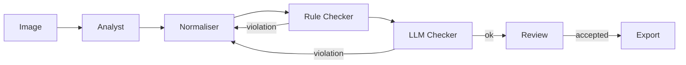

# Architecture & Components

How Caption Agent processes images: what the pipeline is made of and how the components connect.

## For beginners

When you run a batch, Caption Agent takes each image through a sequence of steps.

The **analyst** looks at the image and describes it in a structured way: what is shown, how the person is dressed, the setting, the camera angle. It does not write a caption — it only collects facts.

The **normaliser** takes the analyst's description and forms the final caption in the required format: trigger token first, then attributes according to the project rules.

The **rule checker** is an instant, deterministic check with no LLM. It looks for required fields, forbidden words, and format mismatches.

The **LLM checker** is a semantic check via LLM. It catches meaning-level problems that are hard to catch with rules.

If either checker finds a violation, the normaliser rewrites the caption taking the feedback into account. The loop repeats until the caption passes all checks or the attempt limit is reached.

## For professionals

The pipeline splits into two phases: **automated processing** and **manual review**.

The automated phase starts when a batch is added to the queue:

1. **Context Reader** — reads image metadata (generation prompt from EXIF/sidecar) so the normaliser and checker know the generation context.
2. **Analyst** — vision LLM, returns a structured JSON: crop, view, clothing, nudity state, expression, setting, other characters, image defects.
3. **Normaliser** — text LLM, consumes the analyst JSON and forms the final caption string per the project's caption policy: trigger token + controllable variables.
4. **Rule Checker** — deterministic (no LLM): checks trigger token presence, canonical framing/view vocabulary, forbidden constructs, policy violations.
5. **LLM Pass Checker** — LLM-based semantic check: attribute contradictions, caption policy violations that regex cannot catch.

Normaliser → RuleCheck → LLMPassCheck form a feedback loop with a shared attempt counter. When the limit is exhausted the item moves to ERROR.

After review the **Exporter** is active: it writes accepted captions as `.txt` sidecar files next to the images.

## Effect on your workflow

Each image in a batch gets its own record with a state. You can watch progress in real time — the batch workspace shows the current state, attempt count, and warnings for every image.

For state details, see [Image Lifecycle](pipeline_image_lifecycle.md).
