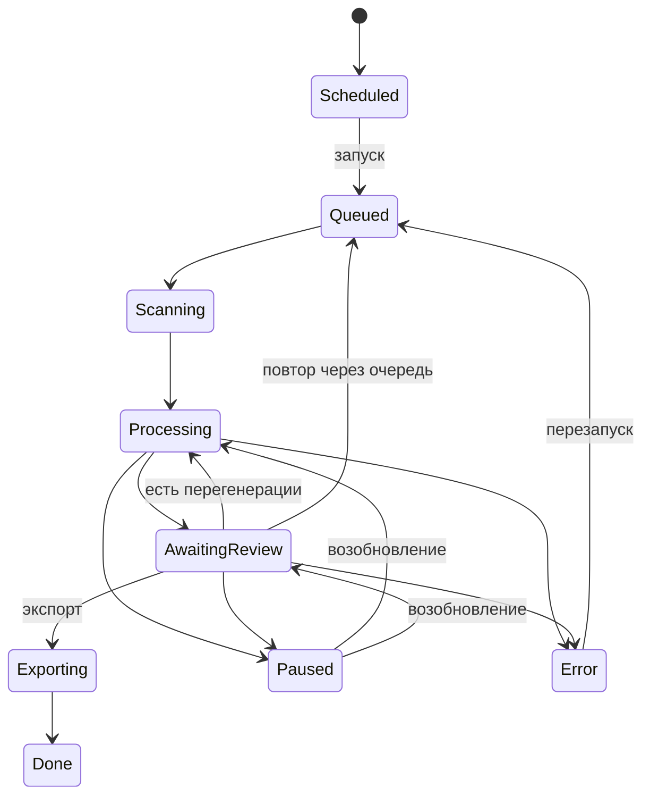

# Жизненный цикл батча

Как меняется состояние батча от момента создания до завершения экспорта.

## Для начинающих

Батч — это группа изображений, которую вы обрабатываете вместе. У батча всегда есть текущее состояние, которое отображается в интерфейсе цветным значком.

Типичный путь батча выглядит так:

**Scheduled** — батч настроен на автозапуск по расписанию, но ещё не запущен.

**Queued** — батч ожидает в очереди. Если идёт другой батч, этот ждёт своей очереди.

**Scanning** — быстрый предварительный проход: читаются метаданные каждого изображения.

**Processing** — основная обработка: каждое изображение проходит через аналитик, нормализатор и проверки.

**Awaiting Review** — обработка завершена. Изображения ждут вашего решения. Возможные следующие шаги: запустить экспорт, отправить часть изображений на перегенерацию, поставить батч на паузу.

**Exporting** — принятые подписи записываются в файлы рядом с изображениями.

**Done** — батч полностью завершён.

**Paused** — обработка приостановлена. Доступна из любого активного состояния. После исправления причины батч можно возобновить — он продолжит с того места, где остановился.

**Error** — необратимая ошибка. Требует вмешательства. После исправления батч можно перезапустить через Queued.

## Для опытных пользователей

Очередь батчей — единая, FIFO. Одновременно обрабатывается не более одного батча. Scheduler запускает Scheduled-батчи в нужное время, переводя их в Queued.

**Paused** — мягкая остановка при достижении порога последовательных LLM-ошибок (transient). Не считается ошибкой; батч возобновляется командой Resume без потери прогресса.

**Crash recovery** — при перезапуске сервера батчи в состоянии Processing или Scanning автоматически переводятся обратно в Queued и обрабатываются повторно с нуля (уже обработанные items сохраняются).

## Влияние на рабочий процесс

Пока батч в состоянии Processing или Scanning, редактировать его настройки нельзя. Кнопка ревью становится активной только когда батч достигает Awaiting Review.

Подробнее о состояниях отдельных изображений — в разделе [Жизненный цикл изображения](pipeline_image_lifecycle.md).
