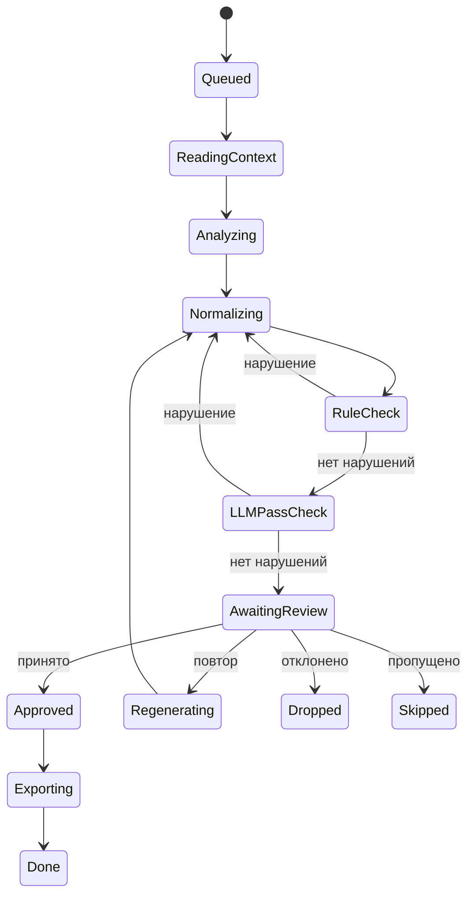

# Жизненный цикл изображения

Как меняется состояние одного изображения на протяжении всей обработки.

## Для начинающих

Каждое изображение в батче проходит свой путь независимо от других. Его состояние показывает, на каком шаге оно сейчас находится или что с ним произошло.

После ревью у вас четыре варианта действий:

- **Принять** — подпись хорошая, отправить на экспорт.
- **Повторить** — попросить pipeline пересоздать подпись.
- **Отклонить** — изображение не нужно в датасете.
- **Пропустить** — отложить решение на потом.

## Для опытных пользователей

Цикл Normalizing → RuleCheck → LLMPassCheck управляется единым счётчиком попыток. По умолчанию разрешено несколько итераций; при исчерпании счётчика item переходит в ERROR с категорией `policy`.

**Regenerating** — после ревью-решения «повторить» item возвращается в Normalizing. Аналитик при этом не перезапускается — используется уже существующее описание. Это позволяет исправить проблему нормализации без дополнительных LLM-вызовов на анализ изображения.

**ERROR-категории:**
- `transient` — сеть или LLM временно недоступны; item можно сбросить и повторить.
- `permanent` — LLM вернул неисправимую ошибку.
- `policy` — превышен лимит попыток нормализации.
- `validation` — LLM вернул невалидный JSON после всех retry.

**Dropped / Skipped** — оба являются финальными состояниями без экспорта. Dropped означает сознательное исключение; Skipped оставляет изображение в базе без подписи.

## Влияние на рабочий процесс

Прогресс по каждому изображению виден в рабочем пространстве батча: текущее состояние, количество попыток нормализации, список предупреждений от checker'ов. Предупреждения не блокируют принятие — это подсказки для вашего решения.
