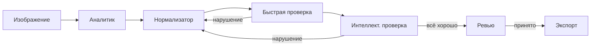

# Архитектура и компоненты

Как Caption Agent обрабатывает изображения: из чего состоит pipeline и как компоненты связаны между собой.

## Для начинающих

Когда вы запускаете обработку батча, Caption Agent последовательно проводит каждое изображение через несколько шагов.

**Аналитик** смотрит на изображение и описывает его структурированно: что изображено, как одет человек, какая обстановка, с какого ракурса снято. Он не пишет подпись — только собирает факты.

**Нормализатор** берёт описание аналитика и формирует итоговую подпись в нужном формате: trigger token, затем атрибуты по правилам проекта.

**Быстрая проверка** — мгновенная детерминированная проверка подписи без LLM. Ищет обязательные поля, запрещённые слова, несоответствие формата.

**Интеллектуальная проверка** — семантическая проверка через LLM. Находит смысловые противоречия, которые сложно поймать правилами.

Если одна из проверок находит нарушение — нормализатор переписывает подпись с учётом замечаний. Цикл повторяется до тех пор, пока подпись не пройдёт все проверки или не исчерпается лимит попыток.

## Для опытных пользователей

Pipeline разделён на две фазы: **автоматическая обработка** и **ручное ревью**.

Автоматическая фаза запускается при добавлении батча в очередь:

1. **Context Reader** — читает метаданные изображения (generation prompt из EXIF/sidecar), чтобы нормализатор и checker знали контекст генерации.
2. **Analyst** — vision LLM, возвращает структурированный JSON с полями: кадрирование, ракурс, одежда, обнажённость, выражение лица, обстановка, прочие персонажи, дефекты изображения.
3. **Normalizer** — text LLM, потребляет JSON аналитика и формирует итоговую caption строку согласно caption policy проекта: trigger token + контролируемые переменные.
4. **Rule Checker** — детерминированный (без LLM): проверяет наличие trigger token, канонический словарь кадрирования/ракурса, запрещённые конструкции, нарушения policy.
5. **LLM Pass Checker** — LLM-based семантическая проверка: противоречия между атрибутами, нарушения caption policy, которые не поймать регулярными выражениями.

Normalizer → RuleCheck → LLMPassCheck образуют петлю обратной связи с единым счётчиком попыток. При исчерпании лимита item переходит в ERROR.

После ревью активен **Exporter**: записывает принятые подписи как `.txt`-файлы рядом с изображениями.

## Влияние на рабочий процесс

Для каждого изображения в батче создаётся отдельная запись с состоянием. Вы можете наблюдать прогресс в реальном времени — в рабочем пространстве батча видны текущее состояние, количество попыток и предупреждения для каждого изображения.

Подробнее о состояниях — в разделе [Жизненный цикл изображения](pipeline_image_lifecycle.md).
